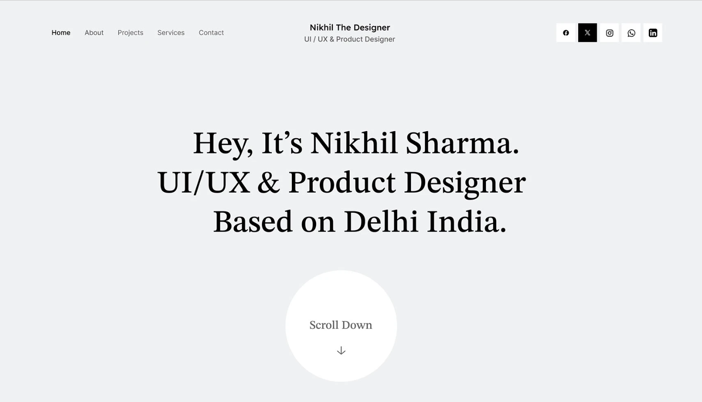

# My-Portfolio
🌐 Personal Portfolio Website | Built with HTML, CSS &amp; JavaScript | Showcasing my skills, experience, projects &amp; contact info
# 🌐 Nikhil Sharma - Portfolio Website  

This is my personal **portfolio website** that highlights my journey as a **Frontend Developer**.  
The portfolio demonstrates my **skills, projects, experience**, and provides an easy way to contact me.  

I created this to **showcase my work to recruiters, collaborators, and tech enthusiasts**.  

---

## 📌 Table of Contents  

- [✨ Features](#-features)  
- [🛠️ Tech Stack](#️-tech-stack)  
- [📂 Project Structure](#-project-structure)  
- [📸 Screenshots](#-screenshots)  
- [⚡ Installation & Setup](#-installation--setup)  
- [🌍 Deployment](#-deployment)  
- [📬 Contact](#-contact)  
- [🚀 Future Improvements](#-future-improvements)  
- [🤝 Contribution](#-contribution)  
- [📜 License](#-license)  

---

## ✨ Features  

- 🎨 Modern UI with **glassmorphism** design  
- 📱 Fully responsive layout  
- 📜 Smooth scrolling navigation  
- 📥 **Download CV** button (opens resume file)  
- 📧 Contact section with **Email & LinkedIn clickable icons**  
- 🌟 Interactive **hover effects, animations & ripple effects**  
- 📂 Organized sections:  
  - Hero (Intro + Buttons)  
  - About Me  
  - Experience  
  - Projects  
  - Contact  

---

## 🛠️ Tech Stack  

- **Frontend**: HTML5, CSS3, JavaScript (ES6)  
- **Styling**: Custom CSS (Glassmorphism, Blur, Shadows, Animations)  
- **Icons & Images**: Custom assets in `/icons` & `/photos`  
- **Deployment**: GitHub Pages  

---

## 📂 Project Structure  


---

## 📸 Screenshots  

### 🏠 Home / Hero Section  
  

### 💼 Experience Section  
  

---

## ⚡ Installation & Setup  

1. Clone this repository:  
   ```bash
   git clone https://github.com/Nikhil870035/My-Portfolio.git
   cd portfolio-website


https://Nikhil870035.github.io/My-Portfolio
